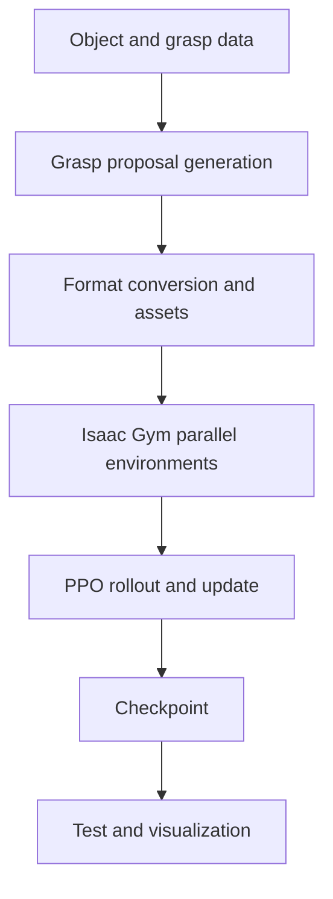

# LinkerHand-UniDexGrasp 核心工程流程复现

> 面向机器人算法、强化学习与具身智能岗位的工程复现记录

[](https://github.com/linker-bot/linkerhand-unidexgrasp)  

本仓库记录我在 Ubuntu + NVIDIA GPU 环境中复现 LinkerHand-UniDexGrasp 核心工程链路的过程：抓取候选生成、数据转换、Isaac Gym 中的 PPO 训练、checkpoint 加载与可视化测试。目标是验证工程流程并沉淀可迁移的排障方法；**不声称达到论文成功率或完整复现论文性能**。

## 3 分钟项目速览

| 面试官关心的问题 | 本项目中的回答 |
|---|---|
| 做了什么？ | 跑通 generation、数据转换、PPO 训练、checkpoint 测试和 Isaac Gym 可视化的核心链路 |
| 难点是什么？ | 老旧研究栈与新硬件之间的 Python ABI、CUDA、PyTorch/C++ 扩展和模型路径兼容 |
| 怎么解决？ | 分层验证解释器、二进制 ABI、GPU 架构、第三方扩展、仿真器和业务脚本 |
| 掌握了什么？ | 灵巧手抓取数据流、并行仿真、PPO rollout/update、点云特征与工程复现方法 |
| 最终结果？ | 完成核心工程流程复现；论文级定量指标仍未验证 |

## 我的工作与上游代码边界

上游项目由 [linker-bot/linkerhand-unidexgrasp](https://github.com/linker-bot/linkerhand-unidexgrasp) 提供，包含适配 Linker Hand L20 的 generation 与 policy 代码。本展示仓库不把上游研究成果包装成个人原创。

我的个人工作：

- 建立 Python 3.8 / PyTorch 1.10 / CUDA 11.3 / Isaac Gym 兼容环境。
- 定位并解决 GraalVM、CPython ABI、RTX 4090 CUDA 架构与 PyTorch 扩展兼容问题。
- 处理 CSDF、PointNet2、Isaac Gym/gymtorch 等本地编译依赖。
- 串联 generation → 数据转换 → PPO → checkpoint → visualization。
- 排查 tensor dtype/device、模型路径和相对路径问题。
- 将试错过程整理为可复用脚本、技术复盘和面试讲解材料。

## 端到端流程



1. **Generation**：使用 GraspIPDF、GraspGlow、ContactNet 等模块生成或评估抓取候选。
2. **数据转换**：统一抓取位姿、关节配置、坐标系和仿真资产。
3. **PPO 训练**：并行采集 rollout，计算 GAE returns，更新 actor–critic。
4. **Checkpoint 测试**：校验配置、网络结构与权重路径后运行测试。
5. **Isaac Gym 可视化**：检查 L20 灵巧手、物体和策略动作链路。

## 快速使用

本仓库是复现说明与安全封装层，不重复托管约 1.8 GB 的上游代码。

```bash
git clone https://github.com/linker-bot/linkerhand-unidexgrasp.git
export UNIDEX_ROOT=/path/to/linkerhand-unidexgrasp
bash scripts/check_environment.sh
bash scripts/train.sh state
CHECKPOINT=/absolute/path/to/model.pt bash scripts/test_checkpoint.sh state
```

> 不同上游提交的 CLI 可能变化。脚本会先检查路径；测试脚本不会猜测未知 checkpoint 参数。

## 我真正解决过的关键故障

> [查看完整复现过程与 11 类失败的逐项复盘 →](docs/full_reproduction_retrospective.md)

其中包含实际遇到的 `torch_sparse cp38 wheel` 不兼容、Python 被切换为 GraalVM、`Failed to load PyTorch C extensions (torch/_C)`、RTX 4090 与旧 CUDA 栈、CSDF/PointNet2 编译、Isaac Gym/gymtorch、`Graphics is nullptr`、tensor 类型和模型路径问题。每项均按“现象 → 根因 → 排查 → 修复 → 可迁移经验”展开。


| 现象 | 根因 | 修复 | 可迁移经验 |
|---|---|---|---|
| `torch/_C` 无法加载 | GraalVM 与 CPython wheel ABI 不匹配 | 恢复 CPython 3.8 并重装 | 先查解释器 ABI，再查业务代码 |
| CUDA extension/arch 失败 | 旧栈对 RTX 4090 Ada 架构支持有限 | 固定兼容组合后重编译 | 区分驱动、runtime、toolkit 与架构 |
| CSDF/PointNet2 导入失败 | 扩展在错误环境编译 | 清缓存，在最终环境构建 | 本地扩展不能简单跨环境复制 |
| Isaac Gym/gymtorch 失败 | Python、torch、NumPy、显示或资产路径不匹配 | 先跑官方 example，再进 task | 用最小样例切分仿真层和业务层 |
| checkpoint 加载失败 | 路径或网络配置不一致 | 路径绝对化并校验配置 | 权重、网络和配置需整体版本化 |

完整复盘见 [docs/troubleshooting.md](docs/troubleshooting.md)。

## 结果与证据边界

- **已完成**：核心工程流程复现与关键兼容问题排查。
- **未宣称**：论文成功率、完整数据集泛化性能或完整论文性能。
- **待补证据**：个人 TensorBoard 曲线、运行截图与 Demo 视频尚未提供到本仓库。
- 媒体补充后将同时记录命令、配置、checkpoint 和日期，保证结果可追溯。

## 文档导航

- [完整复现与失败复盘（建议优先阅读）](docs/full_reproduction_retrospective.md)
- [从复现中形成的工程思考](docs/engineering_insights.md)
- [项目架构](docs/architecture.md)
- [完整复现流程](docs/reproduction_pipeline.md)
- [PPO 核心流程](docs/ppo_pipeline.md)
- [技术故障复盘](docs/troubleshooting.md)
- [面试讲解提纲](docs/interview_guide.md)
- [验证状态与待补材料](docs/verification_status.md)
- [素材提交规范](assets/README.md)

## 致谢

感谢 LinkerBot 与 UniDexGrasp 作者公开研究代码。上游代码、数据和模型请遵守其各自许可证与使用条款。