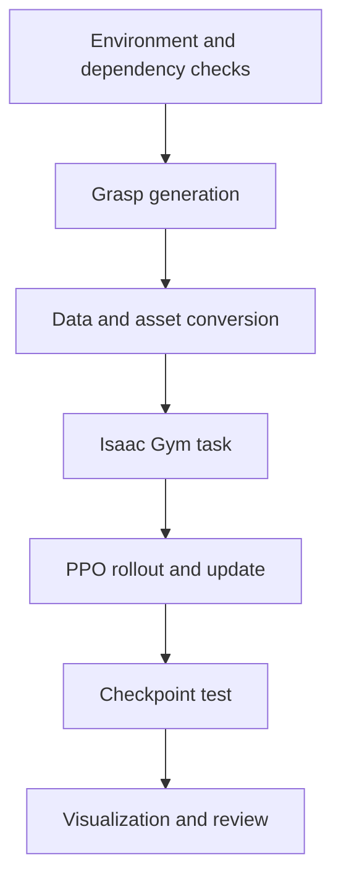

# LinkerHand-UniDexGrasp 复现记录

这个分支记录我复现 LinkerHand-UniDexGrasp 的过程。我保留了环境搭建、数据准备、抓取生成、PPO 训练、checkpoint 测试和 Isaac Gym 可视化之间的关系，也记录了中途出现的错误判断和修正。

我不把上游项目的算法实现当作自己的贡献，也不把程序启动或模型加载等同于论文性能复现。当前更准确的结论是：我完成了核心工程流程的复现，但没有在论文完整数据集和评估协议上验证 benchmark。

上游项目：[linker-bot/linkerhand-unidexgrasp](https://github.com/linker-bot/linkerhand-unidexgrasp)

## 1. 我最初想完成什么

我最初把目标理解得比较简单：按照 README 配好环境，运行 generation 和 policy 代码，看到灵巧手在 Isaac Gym 中动作，就可以认为项目已经复现。

实际推进后我发现，这个判断过于粗糙。项目至少包含以下几层：

1. Python、PyTorch、CUDA 与 Isaac Gym 是否兼容。
2. CSDF、PointNet2、gymtorch 等本地扩展是否在同一 ABI 环境中构建。
3. 抓取数据、物体资产、关节定义和 task 配置是否一致。
4. PPO 的 observation、action、reward 和 checkpoint 是否来自同一个任务。
5. 程序运行、任务行为和论文指标是否分别得到验证。

因此我后来不再追求一次性跑通，而是逐层建立最小验证。

## 2. 我实际完成的流程



- 我建立了与上游旧研究栈相匹配的 CPython、PyTorch、CUDA 和 Isaac Gym 环境。
- 我处理了 generation 依赖、抓取数据转换和仿真资产加载。
- 我梳理了 PPO 中 task、actor–critic、rollout storage 和 checkpoint 的调用关系。
- 我完成了训练、保存权重、加载测试和可视化的核心链路。
- 我把失败过程整理为可复用的检查脚本和复盘文档。

## 3. 我经历的主要判断变化

| 我最初的判断 | 实际检查后发现 |
|---|---|
| requirements 安装失败主要是下载源问题 | `cp38` wheel 与解释器实现、版本和 ABI 直接相关 |
| Python 能启动说明环境正常 | Python 一度变成 GraalVM，纯 Python 可运行不代表 CPython 扩展可加载 |
| `nvidia-smi` 正常说明 CUDA 环境正常 | driver、runtime、toolkit、PyTorch wheel 和 GPU 架构需要分别确认 |
| 扩展安装成功就可以使用 | CSDF、PointNet2 还需要真实输入的 shape、dtype、device 测试 |
| Isaac Gym 报 graphics 错误就是显卡问题 | 也可能来自 headless 配置、图形上下文或纹理路径 |
| checkpoint 文件存在就能测试 | 权重必须与网络结构、observation、action、task 和配置一起对应 |
| 窗口能够运行就等于复现完成 | 这只能证明程序链路推进，不能证明论文性能 |

这些判断变化的完整时间线见 [完整复现与失败复盘](docs/full_reproduction_retrospective.md)。

## 4. 我如何逐层排错

```text
解释器与 ABI
└── PyTorch 与 CUDA
    └── 本地 C++/CUDA 扩展
        └── Isaac Gym 平台
            └── 数据与资产
                └── task 与 tensor 契约
                    └── PPO 与 checkpoint
```

我后来形成的原则是：先验证平台，再验证项目；先验证 import，再验证最小 op，最后才接入真实数据。每修复一层后出现新报错，通常说明程序已经运行到下一层，并不必然说明之前的方向错了。

## 5. 项目与算法理解

我把上游工程分成两个部分：

- `dexgrasp_generation_forlinker`：根据物体几何生成和评估抓取候选，涉及 GraspIPDF、GraspGlow、ContactNet、CSDF 和运动学。
- `dexgrasp_policy_l20hand`：在 Isaac Gym 中构建 task，通过 PPO 或 DAgger 学习策略并保存 checkpoint。

在 PPO 中，机器人任务不是算法之外的附属部分。关节顺序、动作缩放、接触奖励、reset 条件或 observation 维度发生变化，本质上都在改变 MDP。优化器代码即使没有错误，任务定义不一致也无法得到有意义的策略。

相关记录：

- [项目结构与数据关系](docs/architecture.md)
- [复现步骤和验证顺序](docs/reproduction_pipeline.md)
- [我对 PPO 代码流程的理解](docs/ppo_pipeline.md)
- [逐项技术故障记录](docs/troubleshooting.md)
- [完整失败时间线](docs/full_reproduction_retrospective.md)
- [这次复现带来的工程认识](docs/engineering_insights.md)

## 6. 运行方式

本仓库不重复提交约 1.8 GB 的上游源码和数据。先准备上游项目并设置路径：

```bash
git clone https://github.com/linker-bot/linkerhand-unidexgrasp.git
export UNIDEX_ROOT=/path/to/linkerhand-unidexgrasp
```

检查环境：

```bash
bash scripts/check_environment.sh
```

调用上游训练入口：

```bash
bash scripts/train.sh state
# 或
bash scripts/train.sh vision
```

检查 checkpoint 路径：

```bash
CHECKPOINT=/absolute/path/to/model.pt bash scripts/test_checkpoint.sh state
```

`test_checkpoint.sh` 只做路径和入口检查，不会猜测不同上游提交中的 checkpoint 参数。

## 7. 当前限制

- 没有复测论文报告的成功率和泛化指标。
- 没有在仓库中提交大型权重、数据集、原始 TensorBoard 日志和缓存。
- 运行截图、曲线和视频需要与具体 commit、配置和 checkpoint 一起解释，不能脱离实验上下文。
- 部分结论来自核心工程链路验证，不应延伸为完整论文复现。

详细状态见 [验证记录](docs/verification_status.md)。