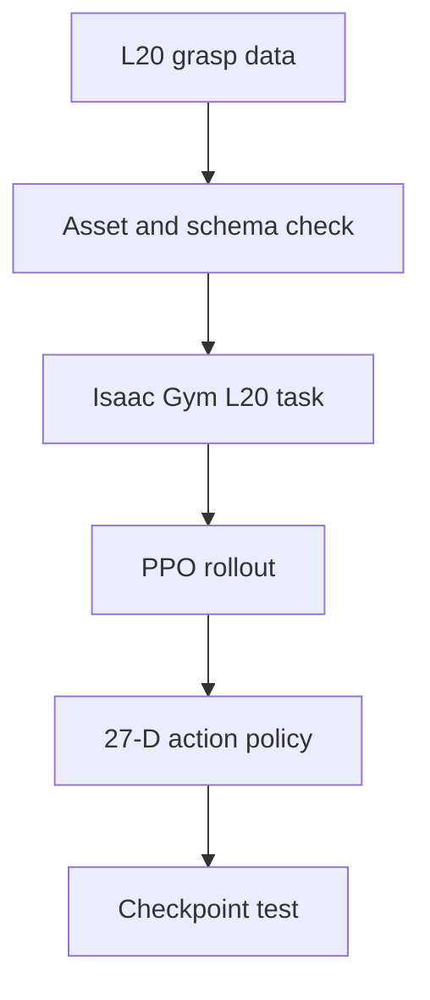
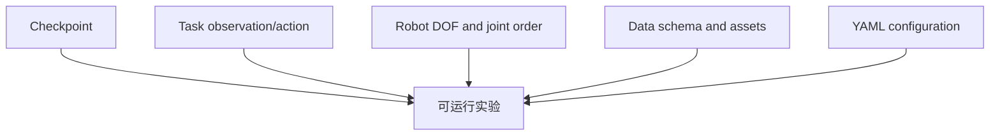

# LinkerHand-UniDexGrasp 复现记录

这个仓库记录我复现 [LinkerHand-UniDexGrasp](https://github.com/linker-bot/linkerhand-unidexgrasp) 的实际过程。这里既保留了最终能够运行的链路，也保留了中途的错误判断、报错和修改。我没有把上游代码当作自己的工作，也不把“模型成功加载”当成“复现了论文性能”。

## 1. 我为什么复现这个项目

我最初想弄清楚两件事：一是 UniDexGrasp 如何把抓取数据、灵巧手模型和强化学习策略连接起来；二是官方提供的 `example_model/model.pt` 是否能直接用于 LinkerHand L20。

第二个判断后来被证明是错误的。我一开始过度相信 `example_model` 这个目录名，以为它就是 L20 的可用示例权重。实际检查 checkpoint 参数形状、任务代码和动作空间后，我确认它是面向原始 ShadowHand 的 DAgger 状态专家模型。

## 2. 我实际完成了什么

- 整理了 generation、数据转换、Isaac Gym 环境、PPO 训练和 checkpoint 测试之间的关系。
- 完成了 LinkerHand L20 的 PPO 训练与测试链路，L20 策略输出为 27 维动作。
- 重新整理官方 `model.pt` 所需的 ShadowHand 数据与资产，沿 DAgger expert 路径加载。
- 通过 checkpoint 参数形状、网络输入和参数名称判断官方模型的真实用途。
- 处理了资产缺失、数据 schema、关节数、构造函数参数、观测维度、`map_location`、reset mask 类型和纹理缺失等问题。

当前结论是：我完成了核心工程流程和官方模型加载路径的复现，但没有复测论文 benchmark，也不报告未经验证的成功率。

## 3. 我的 L20 训练链路



我的 L20 模型与官方模型不是同一个实验：

| 项目 | 我的 L20 模型 | 官方 `example_model/model.pt` |
|---|---|---|
| 机器人 | LinkerHand L20 | ShadowHand |
| 训练路径 | PPO | DAgger state expert |
| 关节数据 | L20 21 个关节 | ShadowHand 22 个关节 |
| 动作维度 | 27 | 24 |
| 网络输入 | 由 L20 task 配置决定 | 300 |

因此两者不能直接比较性能，也不能把官方模型加载到 L20 task 后用报错去判断模型好坏。

## 4. 官方模型复现过程中发现的问题

我依次遇到了这些问题：

1. 缺少 `datasetv4.1`、`meshdatav3_pc_feat`、`meshdatav3_scaled`。
2. 原 YAML 中的 Car 对象在本地资产中不存在。
3. L20 NPZ 使用 `arr_0/arr_1/arr_2`，官方 task 读取 `qpos/scale/plane`。
4. L20 是 21 个关节，ShadowHand 是 22 个关节，不能只改字段名。
5. 我从 `result.pt` 重新生成了 ShadowHand 格式数据。
6. task 构造函数调用缺少 `args`。
7. 视觉 PPO 网络期望 348 维输入，checkpoint 第一层对应 300 维输入。
8. 参数名称和代码路径进一步说明它应作为 DAgger expert 加载。
9. `map_location` 被放到了 `load_state_dict`，而不是 `torch.load`。
10. state expert task 的 `numObservations` 需要从 254 对齐到 300。
11. `torch.where` 的 reset 条件需要显式转换为 bool。
12. 桌面纹理缺失会影响显示，但不是策略加载的阻塞问题。
13. 官方模型和我的模型出现不同物体，来自各自 YAML 的 `object_code_dict`，不是 checkpoint 自带物体。

完整时间线见 [官方模型复现记录](docs/official_model_reproduction.md)。

## 5. 我对模型、任务、数据和配置关系的理解



这次排错让我意识到，checkpoint 不是一个可以脱离上下文使用的文件。它只保存网络参数；能否运行取决于模型结构、任务观测、动作空间、机器人自由度、数据 schema 和 YAML 配置是否与训练时一致。

模型能被找到，不代表它能在当前任务中运行；数据文件存在，也不代表 schema 与代码一致。张量维度报错通常不是某一行代码的孤立问题，而是配置和观测设计没有对齐。

## 6. 当前仍存在的限制

- 我没有在官方完整数据集和评估协议上复测论文结果。
- 官方模型与 L20 模型属于不同机器人和训练路径，不能作直接数值对比。
- 大型数据集、权重、原始日志和缓存没有提交到仓库。
- 桌面纹理问题只按非阻塞问题处理，没有把显示效果作为算法验证依据。
- 运行结果仍应结合具体 commit、YAML、对象列表和命令解释。

## 7. 项目目录与运行方法

```text
docs/
├── official_model_reproduction.md  # 官方模型的时间顺序复盘
├── debugging_playbook.md           # 我形成的排错方法
└── changelog_official_model.md     # 本轮修改记录
scripts/
├── inspect_checkpoint.py
├── validate_assets.py
├── inspect_npz_schema.py
├── run_official_expert.sh
└── run_l20_policy.sh
```

先设置上游项目路径：

```bash
export UNIDEX_ROOT=/path/to/linkerhand-unidexgrasp
python scripts/inspect_checkpoint.py "$UNIDEX_ROOT/dexgrasp_policy_l20hand/dexgrasp/example_model/model.pt"
python scripts/inspect_npz_schema.py /path/to/sample.npz
python scripts/validate_assets.py --root "$UNIDEX_ROOT/dexgrasp_policy_l20hand/dexgrasp" --config /path/to/task.yaml
```

官方 ShadowHand expert 和我的 L20 policy 使用两个独立入口：

```bash
EXPERT_MODEL=/absolute/path/model.pt bash scripts/run_official_expert.sh
L20_MODEL=/absolute/path/model.pt bash scripts/run_l20_policy.sh
```

脚本不会写死服务器路径；额外参数通过 `EXTRA_ARGS` 传入。