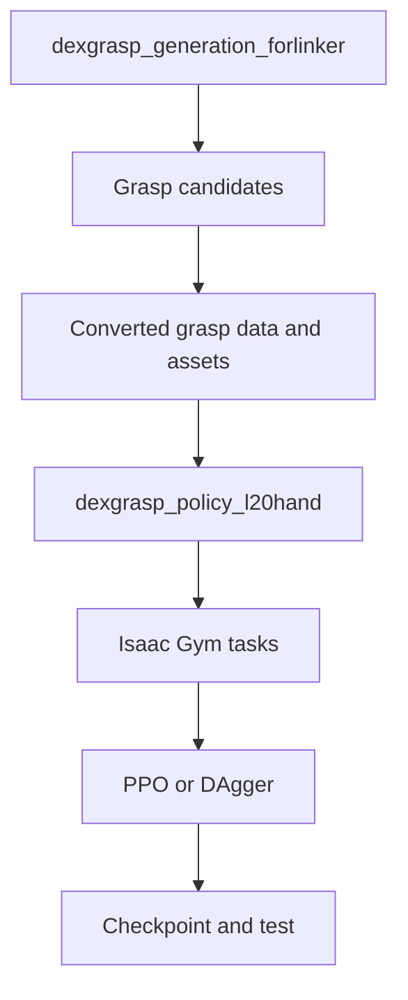

# 我对项目结构的理解

我最开始把仓库看成一套可以直接运行的灵巧手强化学习代码。实际阅读后，我发现它由抓取生成和策略执行两条相互依赖、但数据含义不同的链路组成。

## 抓取生成部分

我把 generation 部分理解为：根据物体几何和手模型，产生可以作为后续训练先验或目标的数据。

- `network/train.py`：GraspIPDF、GraspGlow、ContactNet 等训练入口。
- `network/eval.py`：抓取候选评估入口。
- `thirdparty/CSDF`：几何距离相关计算。
- `thirdparty/pytorch_kinematics`：运动学计算。
- `DFCdata`、MJCF 和 mesh：抓取标签、机器人与物体资产。

这部分最容易被忽略的是数据语义。即使文件名相同，关节顺序、坐标系或 scale 定义不同，也不能直接送入 policy task。

## 策略执行部分

- `dexgrasp/tasks/`：构造 observation、action、reward、reset 和物体加载。
- `dexgrasp/algorithms/rl/ppo/`：actor–critic、rollout storage 和 PPO 更新。
- `dexgrasp/algorithms/rl/dagger/`：学生策略与状态专家的模仿路径。
- `dexgrasp/utils/`：配置解析、task 创建和算法实例化。
- `dexgrasp/script/`：state PPO、vision PPO 和 DAgger 启动入口。

## 我后来建立的对应关系

| 对象 | 我会检查什么 |
|---|---|
| object asset | object code、mesh、scale、碰撞与纹理路径 |
| grasp data | key、shape、dtype、坐标系和关节顺序 |
| observation | 配置维度与实际 tensor 是否相同 |
| action | 维度、动作缩放与机器人受控自由度 |
| reward/reset | 是否与任务目标一致，mask 类型是否正确 |
| checkpoint | 模型结构、输入输出、task 配置和代码版本 |

这一步让我意识到，checkpoint 不是独立成果，而是整套实验上下文中的一个文件。