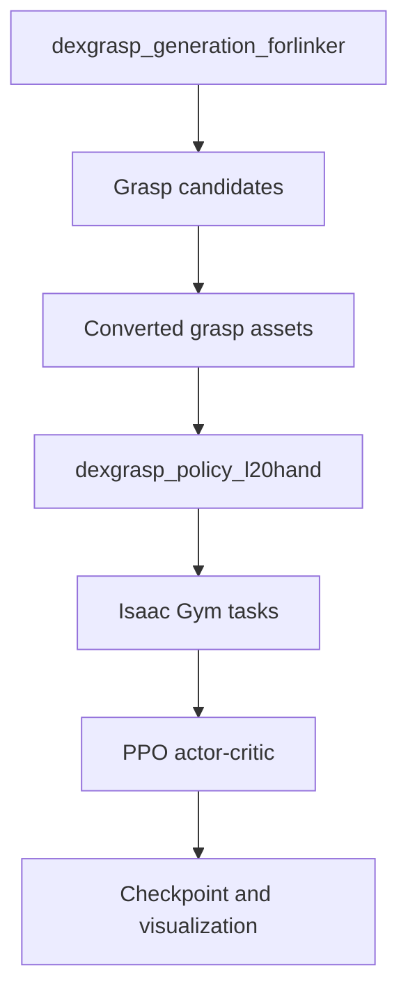

# 项目架构

上游工程可分为抓取生成与策略执行两条主线。本仓库只维护复现说明、脚本和证据索引，不复制上游大体积源码。

## Generation 层

- `network/train.py`：GraspIPDF、GraspGlow、ContactNet 等训练入口。
- `network/eval.py`：抓取候选评估入口。
- `thirdparty/CSDF`：几何距离场相关能力。
- `thirdparty/pytorch_kinematics`：运动学计算。
- `data/DFCdata` 与 `data/mjcf`：抓取标签和手模型资产。

## Policy 层

- `dexgrasp/tasks/`：状态、奖励、终止条件、物体加载与仿真交互。
- `dexgrasp/algorithms/rl/ppo/`：actor–critic、rollout storage 与 PPO 更新。
- `dexgrasp/utils/`：配置解析、task 创建和算法装配。
- `dexgrasp/script/`：state PPO、vision PPO 与 DAgger 的命令入口。

## 数据与控制关系

| 对象 | 作用 | 常见风险 |
|---|---|---|
| object asset | 构建仿真物体 | 路径、scale、碰撞模型不一致 |
| grasp pose / joints | 提供目标抓取状态 | 坐标系和关节顺序不一致 |
| observation | 策略输入 | 维度、dtype、device 不一致 |
| action | 控制关节目标 | action scale 与关节限制不一致 |
| reward | 定义学习目标 | 奖励尺度或稀疏性导致训练不稳定 |
| checkpoint | 保存网络参数 | 网络结构和配置不匹配 |

## 上游与个人工作的边界

算法实现、任务环境和模型结构来自上游；个人工作的价值主要体现在环境兼容、端到端集成、问题定位、流程验证和复盘文档。