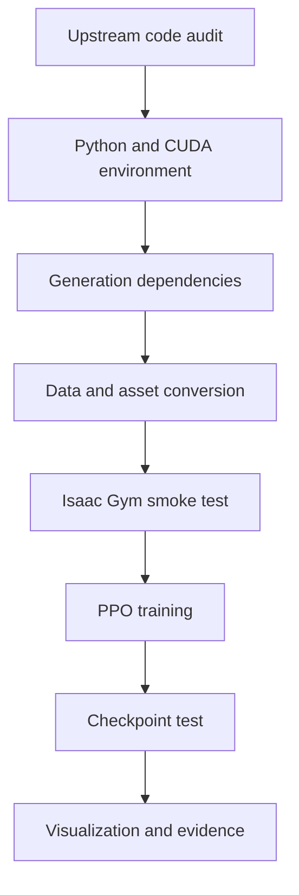

# LinkerHand-UniDexGrasp 完整复现与失败复盘

> 这份文档记录的不是一条“安装成功”的直线，而是我如何把一个旧研究栈逐层拆开、定位并重新接起来。复现结论是：核心工程流程已跑通；论文级性能尚未验证。

## 1. 我对项目的理解

LinkerHand-UniDexGrasp 不是单一的强化学习脚本，而是两条链路的组合：

1. **抓取生成**：根据物体几何生成候选抓取位姿和手部关节配置，涉及 GraspIPDF、GraspGlow、ContactNet、CSDF、运动学与数据集。
2. **策略执行**：在 Isaac Gym 中构造灵巧手与物体环境，通过 PPO 学习从状态或点云观测到关节动作的策略，并保存 checkpoint 供测试和可视化。

复现失败往往不是某一行代码错误，而是 Python ABI、PyTorch wheel、CUDA runtime、本地扩展、GPU 架构、仿真器和资产路径之间的组合不一致。

## 2. 复现路径



我的排查原则是：**每一层通过最小测试后才进入下一层**。例如 Isaac Gym 官方 example 都不能运行时，不应该直接修改 PPO reward。

## 3. 失败一：requirements 中的 wheel 与 Python 不匹配

### 现象

安装 `requirements.txt` 时，类似 `torch_sparse-0.6.13` 的 `cp38` wheel 被判定为当前平台不支持。

### 根因

`cp38` 表示该二进制 wheel 面向 CPython 3.8 ABI。当前解释器版本或实现不是它预期的 CPython 3.8，pip 因此拒绝安装。

### 排查

```bash
which python
python -VV
python -c "import platform,sys; print(platform.python_implementation()); print(sys.version)"
python -m pip debug --verbose
```

我不再把“Python 能启动”当作环境正确，而是核对解释器实现、版本、pip 所属解释器和 wheel tag。

### 修复

重新建立 CPython 3.8 环境，始终使用 `python -m pip`，然后安装与 PyTorch 1.10.0 + CUDA 11.3 对应的依赖。

### 可迁移经验

遇到 `not a supported wheel on this platform`，优先检查 wheel tag 和 ABI，而不是反复换镜像源。

## 4. 失败二：Python 被切换为 GraalVM

### 现象

环境处理中 Python 一度变成 GraalVM；纯 Python 包可能还能运行，但 PyTorch、PointNet2 等二进制扩展开始异常。

### 根因

GraalVM Python 与 CPython 不是同一个 ABI。研究项目常依赖 `.so` 扩展，这些文件通常按 CPython ABI 编译。

### 排查

除 `python --version` 外，还检查 `platform.python_implementation()`、解释器实际路径和 conda 环境中的软链接。

### 修复

恢复 CPython，清理错误解释器安装期间生成的 wheel、build 与 torch extension 缓存，再在最终环境重新安装。

### 可迁移经验

“语法兼容”不等于“二进制兼容”。只要项目含 PyTorch/CUDA/C++ 扩展，就必须把 ABI 当作首要约束。

## 5. 失败三：PyTorch C extensions 无法加载

### 现象

```text
ImportError: Failed to load PyTorch C extensions (torch/_C)
```

### 根因

可能原因包括错误解释器 ABI、pip 与 python 不属于同一环境、残留源码目录遮蔽已安装包，或安装被中断。本次问题与解释器切换和环境污染强相关。

### 排查

```bash
python -c "import sys; print(sys.executable)"
python -m pip show torch
python -c "import torch; print(torch.__file__)"
python -c "import sys; print(sys.path)"
```

同时检查当前目录是否存在名为 `torch` 的源码目录，防止模块遮蔽。

### 修复

统一解释器与 pip，卸载损坏的 torch，清除残留后重装 PyTorch 1.10.0 对应版本，并用最小 import 测试确认。

### 可迁移经验

不要在 import 失败时立刻修改项目源码；先证明第三方框架自身能够独立导入。

## 6. 失败四：旧 CUDA 研究栈与 RTX 4090

### 现象

CSDF、PointNet2、gymtorch 等 CUDA 扩展可能编译失败、出现架构警告，或生成的 kernel 无法在 RTX 4090 上运行。

### 根因

上游基线是 PyTorch 1.10.0 + CUDA 11.3，而 RTX 4090 使用 Ada 架构。新驱动可运行旧 CUDA runtime，并不保证旧编译工具链天然认识新的 compute capability。

### 排查

```bash
nvidia-smi
nvcc --version
python -c "import torch; print(torch.__version__, torch.version.cuda); print(torch.cuda.get_device_capability())"
```

我把下面五层分别判断：driver、CUDA runtime、CUDA toolkit、PyTorch wheel、目标 GPU 架构。

### 修复策略

- 保持 NVIDIA driver 能向后兼容项目 runtime。
- 对需要源码编译的扩展显式检查 `TORCH_CUDA_ARCH_LIST`。
- 清除旧 build 结果，在最终 torch/CUDA 环境重新编译。
- 若旧 nvcc 无法生成目标架构，则使用兼容架构/PTX策略或调整整套版本，而不是只升级单包。

### 可迁移经验

`nvidia-smi` 显示的 CUDA 版本不是 conda 中 PyTorch 实际使用的 runtime 版本。必须分层判断。

## 7. 失败五：CSDF 安装与加载

### 现象

CSDF editable install 完成后仍可能导入失败，或在实际几何计算时触发扩展错误。

### 根因

CSDF依赖本地编译环境。解释器、torch、CUDA 任一项变化后，原 `.so` 都可能失效。

### 排查与修复

1. 检查 `pip show` 的 editable 路径。
2. 删除 `build/`、旧 `.so` 和 torch extensions 缓存。
3. 确认 gcc/nvcc 与当前环境。
4. 在最终 conda 环境执行 `pip install -e .`。
5. 用单独的 import 和最小几何输入测试，而不是直接启动训练。

### 思考

CSDF不是普通 Python 库，而是“源码 + 当前环境共同生成的二进制产物”。环境变更后需要重新构建。

## 8. 失败六：PointNet2

### 现象

PointNet2 可能在安装阶段失败，也可能导入成功后在点云算子处报告 shape、dtype、contiguous 或 CUDA device 错误。

### 根因

它同时有两类契约：编译期的 torch/CUDA ABI，以及运行期的 tensor shape/dtype/device。

### 排查与修复

- 先做 `import pointnet2_ops`。
- 再使用小规模 `float32`、CUDA、contiguous 点云做 op smoke test。
- 最后接入真实 observation，并在编码器入口打印 shape/dtype/device。

### 可迁移经验

“能 import”只证明动态库被找到，不证明真实数据满足算子契约。

## 9. 失败七：Isaac Gym 依赖与 NumPy/Gym 版本

### 现象

Isaac Gym/gymtorch 编译、导入或运行不稳定，并出现旧 Gym/NumPy 兼容警告。

### 根因

Isaac Gym Preview 是冻结的研究软件，依赖旧 Python、PyTorch、Gym 和 NumPy。随意安装最新版会破坏兼容组合。

### 修复

固定兼容版本，例如项目过程中使用 `gym==0.23.1`、`numpy==1.23.5`，并先运行 Isaac Gym 官方 example，确认平台层正常后再运行 UniDexGrasp。

### 可迁移经验

对于停止更新的研究平台，“最新版本”通常不是“最兼容版本”。

## 10. 失败八：gymtorch JIT 与扩展编译

### 现象

gymtorch 首次运行需要编译扩展，可能长时间卡住或因编译环境/架构失败。过程中尝试过 `PYTORCH_JIT=0`、`TORCH_CUDA_ARCH_LIST` 等设置。

### 思考与结论

`PYTORCH_JIT=0` 不能替代正确的 ABI 和 CUDA 构建环境。环境变量只能解决特定编译路径问题，不能掩盖解释器或版本错误。最终策略应是先让官方 gymtorch 示例完成编译，再复用缓存进入项目。

## 11. 失败九：Graphics is nullptr

### 现象

```text
Graphics is nullptr in GymCreateTextureFromFile
```

### 根因候选

- headless/graphics device 配置不一致。
- viewer 或图形上下文未正确创建。
- 纹理文件路径无效，资产加载链路继续调用了 graphics API。
- 远程服务器没有正确显示环境。

### 排查

1. 区分训练是否需要 viewer；先用 headless 验证物理与策略。
2. 检查 `graphics_device_id` 与 `compute_device_id`。
3. 对纹理路径使用 `realpath`/`test -f`。
4. 先加载无纹理最小资产，再恢复完整资产。

### 可迁移经验

图形错误不一定是显卡驱动错误，也可能是资产路径触发的二次故障。需要把 physics、graphics、asset 三条链路分开。

## 12. 失败十：模型与资产路径

### 现象

项目在某个目录能运行，换终端或工作目录就找不到 checkpoint、MJCF、纹理、object asset；代码中还可能残留服务器绝对路径。

### 根因

相对路径由当前工作目录解释；训练配置、测试脚本和模型文件没有形成统一版本关系。

### 修复

- 启动时打印 `cwd` 和解析后的绝对路径。
- 使用 repo root 或配置文件作为路径基准。
- 用 `UNIDEX_ROOT`、`CHECKPOINT` 注入路径。
- 加载权重前检查文件存在、网络结构和 observation 配置。

### 可迁移经验

checkpoint 不是单独的 `.pt` 文件，而是“权重 + 网络结构 + observation/task 配置 + 代码版本”的组合。

## 13. 失败十一：PyTorch tensor 类型兼容

### 现象

gym tensor API、索引、拼接或赋值时出现 `float/double`、`int32/int64`、CPU/CUDA 不一致。

### 排查方法

在数据进入每个关键边界时记录：

```python
print(tensor.shape, tensor.dtype, tensor.device, tensor.is_contiguous())
```

重点边界包括数据转换输出、point cloud encoder、environment observation、action 与 root/dof state tensor。

### 修复

在数据入口显式统一 dtype/device/index type，避免等报错传播到深层 CUDA op 后再修。

### 可迁移经验

对 PyTorch 工程而言，tensor 的完整接口契约是 `shape + dtype + device + layout`。

## 14. 如何判断“复现成功”

我把复现分成四级，而不是看到窗口启动就宣布成功：

| 层级 | 判据 | 本项目表述 |
|---|---|---|
| L1 环境成功 | 依赖可导入，GPU/Isaac Gym example 可运行 | 已完成 |
| L2 程序成功 | generation、训练、测试、可视化入口可执行 | 核心流程已完成 |
| L3 任务成功 | 策略能产生符合任务目标的行为 | 有运行结果，证据待补入仓库 |
| L4 论文复现 | 在相同数据与协议下接近论文指标 | 未验证 |

因此本仓库使用“完成核心工程流程复现”，而不使用“完全复现论文性能”。

## 15. 我形成的通用排障方法

```text
现象记录
└── 最小复现
    ├── Python/ABI
    ├── PyTorch/wheel
    ├── CUDA/extension
    ├── Isaac Gym/platform
    ├── asset/path
    └── task/PPO
        └── 修复后回归测试与证据留存
```

核心原则：

- 一次只改变一个变量。
- 先验证平台，再验证项目。
- 先验证 import，再验证最小 op，再验证真实数据。
- 对每次成功保存版本、命令、日志和截图。
- 不用“窗口打开”替代定量评估，也不把上游结果当作个人结果。