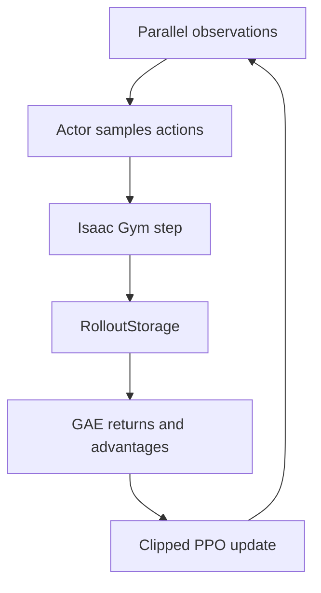

# 我对 PPO 代码流程的理解

我最初关注的是 `ppo.py` 中的 update 公式，但实际调试后发现，PPO 是否能正常工作首先取决于 task 输出的数据契约。



## 1. Rollout

actor–critic 根据 observation 产生动作、动作对数概率和 value。环境执行动作后返回下一观测、奖励与 done，transition 被写入 `RolloutStorage`。

这里任何 shape、dtype、device 或 action dimension 错误，都会在后续更新中继续传播。

## 2. GAE

```text
δ_t = r_t + γV(s_{t+1}) - V(s_t)
```

GAE 使用 `γ` 和 `λ` 汇总多步 TD residual，在偏差与方差之间折中。上游实现中可以看到 `gamma=0.998`、`lam=0.95` 等参数，但具体效果仍依赖任务奖励尺度。

## 3. PPO clipping

```text
L_clip = E[min(r_t A_t, clip(r_t, 1-ε, 1+ε) A_t)]
```

我把 clipping 理解为限制同一批 rollout 上的策略变化，避免一次更新过远。它不能修复 observation 或 action 语义错误。

## 4. 代码对应

| 模块 | 我理解的作用 |
|---|---|
| actor–critic | 输出动作分布和状态价值 |
| rollout storage | 保存采样得到的 transition |
| compute_returns | 计算 return 和 advantage |
| update | 多 epoch、mini-batch 更新网络 |
| TensorBoard | 记录 reward、episode length 和 loss |
| checkpoint | 保存网络参数，不保存完整实验上下文 |

## 5. 灵巧手任务中的实际影响

- 高维动作空间使探索和动作缩放更敏感。
- 接触奖励可能稀疏，reward 分解比单一总分更容易定位问题。
- 并行环境提高采样速度，也增加显存和资产加载压力。
- 视觉策略还依赖点云编码器，PointNet2 的输入契约会影响整个策略。
- checkpoint 测试必须恢复相同的 task 和 observation 设计。

这次复现让我认识到，理解 PPO 不能只停留在损失函数；机器人、数据和环境共同定义了算法实际优化的问题。