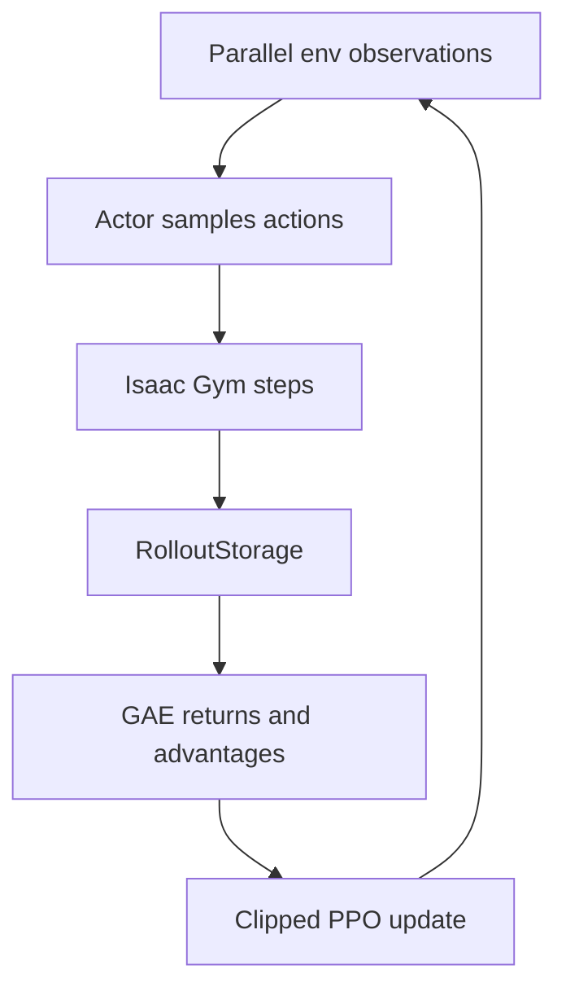

# PPO 核心流程

上游 PPO 由 actor–critic、`RolloutStorage` 和优化循环组成。理解重点不是背代码，而是看清“数据从哪里来、为什么可以更新策略”。



## 1. Rollout

策略根据观测产生动作、动作对数概率和状态价值；环境返回下一观测、奖励与 done。每一步 transition 被写入 storage。

## 2. GAE

时间差分残差为：

```text
δ_t = r_t + γ V(s_{t+1}) - V(s_t)
```

GAE 使用 `γ` 和 `λ` 对多步残差加权，在偏差与方差之间折中。上游默认参数中可见 `gamma=0.998`、`lam=0.95`。

## 3. Clipped objective

PPO 使用新旧策略概率比 `r_t(θ)`，并裁剪其变化范围，避免一次更新让策略漂移过远：

```text
L_clip = E[min(r_t A_t, clip(r_t, 1-ε, 1+ε) A_t)]
```

上游 `clip_param` 默认值为 0.2，同时优化 value loss，并可加入 entropy 奖励维持探索。

## 4. 工程实现对应

| 模块 | 职责 |
|---|---|
| actor–critic | 输出动作分布、log probability 和 value |
| rollout storage | 保存 obs/state/action/reward/done/value |
| compute_returns | 计算 returns 与 advantage |
| update | mini-batch、多 epoch 更新网络 |
| TensorBoard writer | 记录 reward、episode length、value/surrogate loss |
| checkpoint | 保存 actor–critic `state_dict` |

## 5. 灵巧手任务中的关键点

- 高维动作空间使探索困难，需要合理 action scale 和关节限制。
- 接触奖励可能稀疏且噪声大，需要关注奖励分解。
- Isaac Gym 并行环境提高采样吞吐，但也放大显存与资产加载压力。
- 视觉策略增加点云编码器，PointNet2 的 shape/device 错误会沿策略链路传播。
- checkpoint 测试必须恢复与训练一致的观测和网络配置。